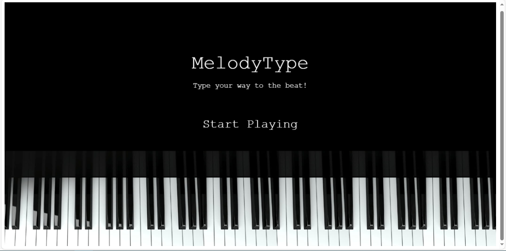

# 🎵 MelodyType 🎵

## Introduction
Welcome to **MelodyType**! This rhythm-based typing game is designed to make practicing typing skills fun and engaging. Players type along to the lyrics of popular songs, syncing their typing speed and accuracy to the rhythm of the music.



### Inspiration ✨
Typing is an essential skill for software engineers but is often overlooked in favor of other technical skills. MelodyType was created to provide a fun and interactive platform for improving typing speed and accuracy, inspired by the joy of music. Typing to the beat of a song combines rhythm and repetition, making the practice more enjoyable and effective.

### Links 🔗
- [Final Project Blog Article](#)
- [Author's LinkedIn](https://www.linkedin.com/in/zainab-salih/)

## Installation 🚀
To run MelodyType locally, follow these steps:

1. Clone the repository:
    ```bash
    git clone https://github.com/Zeyy404/MelodyType.git
    ```
2. Navigate to the project directory:
   ```bash
   cd MelodyType
   ```
3. Install the required dependencies:
   ```bash
   npm install http-server
   ```
4. Start the local development server:
   ```bash
   http-server -p 8000 --cors
   ```

## Usage 🎮
1. Open your web browser and go to `http://localhost:8000` to access the game.
2. On the home screen, click "Start Playing" to begin.
3. Select a song from the list to start the game.
4. Type the lyrics as they appear on the screen in sync with the music.
5. Press `Enter` to submit each line of lyrics.


## Technical Details ⚙️
The game uses a simple yet effective algorithm to match user input with the lyrics. Here's a breakdown of the key components:

- **Lyrics Fetching**: Lyrics are fetched from an external API (`https://api.lyrics.ovh`). The lyrics are then split into lines and displayed one line at a time.
- **Typing Detection**: The game listens for keyboard events and matches the user's input against the current line of lyrics. If the user types the correct character, it is removed from the display, giving immediate feedback.
- **Scrolling Mechanism**: When the user presses `Enter`, the game checks if the line is complete and scrolls to the next line of lyrics. The smooth scrolling effect is achieved using Phaser's tweening capabilities.
- **Music Synchronization**: The Howler.js library is used to play the selected song and manage playback events. The game ensures that the lyrics are typed in sync with the music, adding an extra layer of challenge.

### Design Choices
- **Phaser 3**: Chosen for its robust game development framework, providing all the necessary tools for creating interactive and engaging games.
- **Howler.js**: Selected for its powerful and easy-to-use audio API, enabling seamless music playback and control.
- **Responsive Design**: Ensuring the game looks great and is fully functional on various screen sizes and devices.

## Contributing 🤝
We welcome contributions to MelodyType! To contribute, follow these steps:

1. Fork the repository.
2. Create a new branch (`git checkout -b feature/YourFeature`).
3. Make your changes and commit them (`git commit -m 'Add new feature'`).
4. Push to the branch (`git push origin feature/YourFeature`).
5. Open a Pull Request.

Please ensure your code adheres to our coding guidelines and includes appropriate tests.

## Related Projects 🔍
- [TypeRacer](https://play.typeracer.com/)
- [10FastFingers](https://10fastfingers.com/typing-test/english)

## Licensing 📜
This project is licensed under the MIT License. See the [LICENSE](LICENSE) file for more details.

---

Thank you for checking out MelodyType! We hope you enjoy playing and improving your typing skills. If you have any feedback or suggestions, feel free to reach out.
